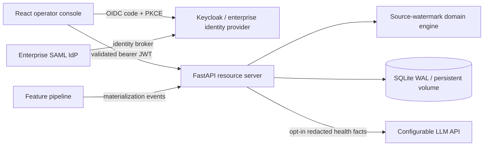

# Feature Freshness Monitor — Ryan Vo | AI & Machine Learning

Current version: `1.0.0`.

Feature Freshness Monitor helps ML platform teams detect stale or missing feature partitions before model predictions consume them. Its deterministic source-watermark engine distinguishes recently completed jobs from genuinely fresh source data. Optional AI explanations summarize measured partition health; they never change policies or incidents.

## Workflows

- Create partition freshness policies with optimistic version checks.
- Record materializations using replay-safe event IDs and source watermarks.
- Evaluate missing/stale partitions and reconcile incident recovery transactionally.
- Inspect paginated incident timelines and administrator-only audit history.
- Request optional explanations from a configurable LLM provider.



## Run locally with Docker Compose

Install Docker Engine with Compose. From the repository root:

```sh
cp .env.example .env
python3 -c 'import secrets; print(secrets.token_urlsafe(32))'
# Put the generated value into KEYCLOAK_ADMIN_PASSWORD in .env.
docker compose up --build -d
docker compose logs -f keycloak
```

Wait for Keycloak to report that it has started. Open its admin console at `http://localhost:8080`, sign in as `admin` with your generated password, and select the imported `freshness` realm. Create a user, set a password, and assign one of the realm roles below. Open the app at `http://localhost:5173` and sign in. No application users or passwords are embedded in the repository.

The local Keycloak container shares the backend network namespace so the API can fetch signing keys over loopback. Ports bind only to the host loopback interface. SQLite and Keycloak development data use named volumes. `docker compose down` preserves them; deleting volumes deletes data.

This Compose configuration is for local development. For a public deployment, use an external HTTPS identity provider or production Keycloak backed by a supported database, configure HTTPS issuer/JWKS URLs, disable `OIDC_LOCAL_HTTP`, and terminate TLS in front of the frontend. Rebuild the frontend with your exact issuer, client ID, and API URL. Restrict redirect URIs and web origins to your actual application origin. Back up the SQLite database through SQLite's backup API before deployment changes; do not copy a live WAL database as a single file.

## Roles and SSO

| Role | Capabilities |
| --- | --- |
| viewer | Read feature policies, health, incidents, and timelines |
| operator | Viewer access plus policy changes, ingestion, evaluation, and AI advice |
| admin | Operator access plus audit log access |

The API validates access-token signatures, issuer, audience, expiry, and recognized roles. The SPA uses authorization code with PKCE and nonce/state checks, verifies the ID token, and keeps access tokens only in memory. Only temporary login state enters session storage. Sign-out clears the app token; the identity provider's SSO session may remain active. Expired sessions require signing in again.

For enterprise SAML login, add a SAML identity provider in Keycloak's `freshness` realm under **Identity providers**, import your organization's metadata, enable signature validation with the trusted signing certificate, and configure the SP metadata/ACS endpoint in your IdP. Map approved users/groups to the realm roles above; never give every brokered user the admin role. The application continues using its OIDC client, so it does not parse SAML assertions itself. See [Keycloak identity brokering documentation](https://www.keycloak.org/docs/latest/server_admin/index.html#_identity_broker). Actual organization-specific SAML metadata and credentials must be supplied by the operator.

## Local development

Python 3.12 and Node.js 24 are required.

```sh
python3 -m venv .venv
.venv/bin/pip install -r backend/requirements.txt
export OIDC_ISSUER=http://localhost:8080/realms/freshness
export OIDC_AUDIENCE=freshness-api
export OIDC_JWKS_URL=http://127.0.0.1:8080/realms/freshness/protocol/openid-connect/certs
export OIDC_LOCAL_HTTP=true
docker compose stop frontend
PYTHONPATH=backend .venv/bin/uvicorn app.main:create_app --factory --port 8001
```

In another terminal:

```sh
cd frontend
npm ci
API_PROXY_TARGET=http://127.0.0.1:8001 VITE_KEYCLOAK_ISSUER=http://localhost:8080/realms/freshness npm run dev -- --port 5173 --strictPort
```

The frontend development proxy forwards `/api` to the local backend on port 8001. Keep the Compose backend and Keycloak running so the local identity provider remains available; only stop the Compose frontend to free port 5173. The development backend uses its own local database.

## LLM configuration

`LLM_API_KEY` is the only LLM credential variable. `LLM_PROVIDER`, `LLM_MODEL`, and `LLM_BASE_URL` are non-secret operator configuration. An empty model disables advice, and the deterministic workflows remain fully functional. Choose the model ID exposed by your provider. No provider is called automatically on page load.

| Provider setting | Base URL |
| --- | --- |
| openai | `https://api.openai.com/v1` |
| compatible | Your OpenAI-compatible `/v1` endpoint |
| anthropic | `https://api.anthropic.com/v1` |
| gemini | `https://generativelanguage.googleapis.com/v1beta` |
| ollama | `http://127.0.0.1:11434` for a local process |

Set the base URL explicitly in `.env` when changing providers. Loopback URLs refer to the backend's network namespace. For container deployments, expose local inference through a configured HTTPS endpoint or arrange a shared local namespace. Keys remain server-side. Advisory requests send only feature IDs, partition names, statuses, and aggregate freshness measurements; review those identifiers before enabling an external provider. Provider errors produce explicit unavailable/rate-limited responses, never fabricated advice.

## AI/ML evaluation

The implemented ML operations component is a deterministic freshness detector, not a trained predictive model. Its reproducible tests use synthetic timestamps and partitions with known boundary conditions: a recent job with stale source data, missing partitions, grace windows, future timestamps, replayed events, monotonic evaluation, and incident recovery. A completion-time-only baseline incorrectly treats a recently completed job with an old source watermark as fresh. The domain tests explicitly cover that failure.

```sh
PYTHONPATH=backend .venv/bin/pytest backend/tests/test_freshness_domain.py backend/tests/test_freshness_store.py -q
PYTHONPATH=backend .venv/bin/pytest backend/tests -q
cd frontend
npm test
npm run build
npm run test:integration
```

Limitations: incorrect source clocks and missing instrumentation can make freshness results misleading; configured thresholds are operational policy, not learned guarantees. Optional LLM advice has no measured prediction-quality claim and may propose incorrect causes. Validate advice against pipeline telemetry. Browser integration tests use Chrome at `/usr/bin/google-chrome` and start ephemeral loopback identity/backend services. They test actual React screens and all three roles. CI mocks external providers and uses generated ephemeral keys rather than real accounts.

## API reference

Interactive OpenAPI documentation is available on the backend at `/docs`. All `/api` routes require a bearer token for audience `freshness-api`.

| Method | Path | Purpose |
| --- | --- | --- |
| GET | `/healthz` | Database liveness |
| GET | `/api/me` | Authenticated subject and roles |
| GET | `/api/features` | Policies in a `features` envelope |
| PUT | `/api/features/{feature}` | Save policy with `expected_version` |
| POST | `/api/features/{feature}/materializations` | Ingest one replay-safe event |
| GET | `/api/features/{feature}/health` | Read current partition health |
| POST | `/api/features/{feature}/evaluate` | Reconcile incidents and transitions |
| GET | `/api/features/{feature}/incidents?active_only=true` | Inspect incidents |
| GET | `/api/features/{feature}/timeline?after=0&limit=100` | Cursor-based transition history |
| GET | `/api/features/{feature}/audit?after=0&limit=100` | Administrator audit history |
| POST | `/api/features/{feature}/advisory` | Optional server-grounded explanation |

Policy input: `{"expected_partitions":["us","eu"],"max_age_seconds":300,"grace_seconds":30,"expected_version":0}`. Creation uses version 0; subsequent updates must use the observed version. Materializations require `event_id`, `partition`, timezone-aware ISO timestamps `source_watermark` and `completed_at`, and nonnegative integer `row_count`. Responses distinguish missing resources (404), stale versions/conflicting event IDs (409), invalid input (422), and authorization failures (401/403). Exact event replays return `created:false` without duplicate state.

## Project layout

`backend/app/domain` holds deterministic rules, `services` owns SQLite transactions and provider adapters, `security` validates JWTs, and `api` applies authorization and HTTP contracts. `frontend/src` contains the typed API client, PKCE session flow, policy/materialization forms, incident UI, and advisory panel. `deploy` contains the local identity realm. GitHub Actions runs tests and builds images on standard public-repository Ubuntu runners; images are not pushed.

---
Ryan Vo · [GitHub](https://github.com/A220man) · ryandtvo@gmail.com · MIT License
